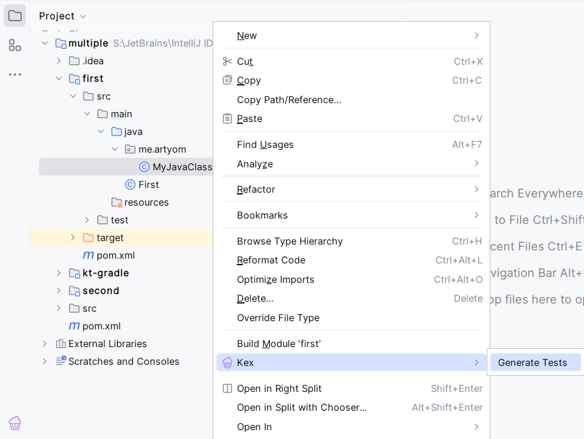
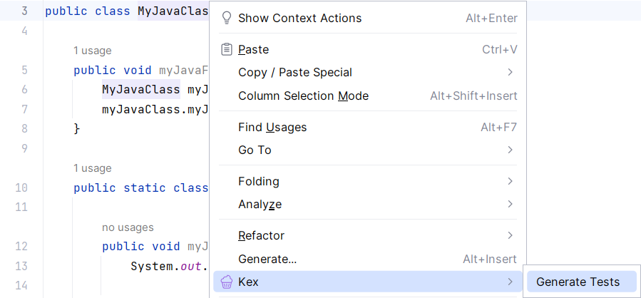
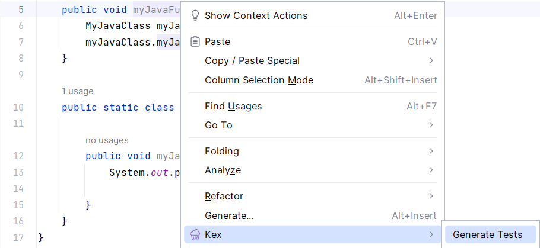
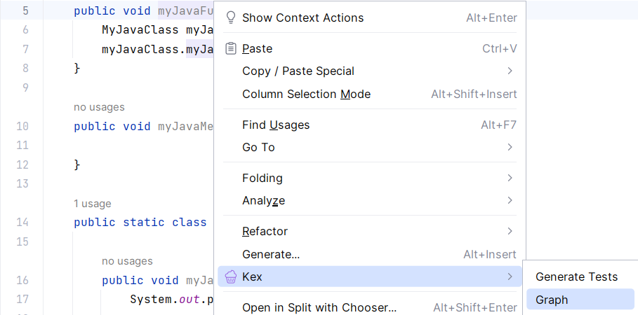
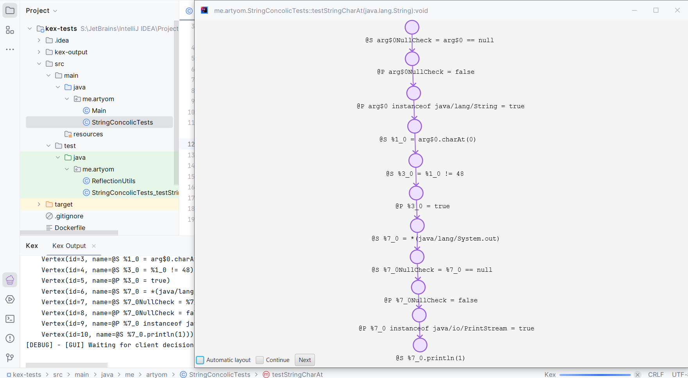
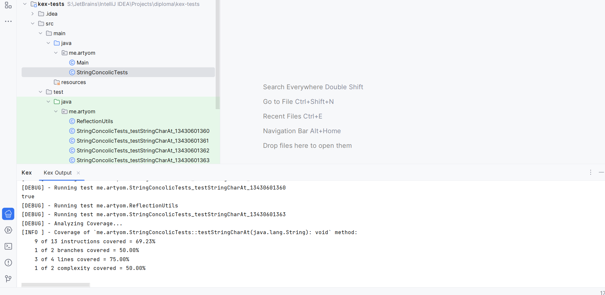
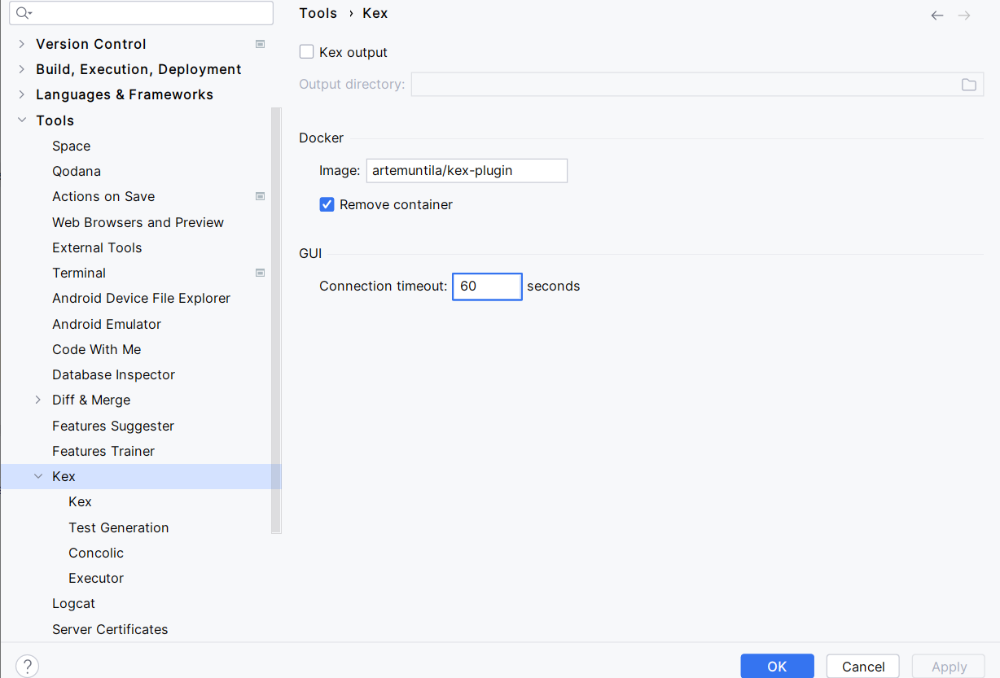

# kex-plugin

[Kex](https://github.com/vorpal-research/kex) is an automatic white-box unit test generation tool
for Java and Kotlin.

[JetBrains Marketplace](https://plugins.jetbrains.com/plugin/21941-kex)

## Constraints

1. To run Kex, [Docker](https://www.docker.com/) must be running.
2. Due to the specifics of Kex, only JDK 8 is supported.

## Features

### Generate tests for class from Project View 

### Generate tests for class or method from Editor

### Visualize method [CFG](https://en.wikipedia.org/wiki/Control-flow_graph) and guide Kex interactively

Advanced usage.

### Debug output and generated tests

After running Kex either by *Generate Tests* or *Graph*, a console view with debug output will pop up from *Kex* tool window.

After successful completion of Kex, generated tests will be stored in module's default test directory, as shown in the figure above.

### Settings

Main *Kex* settings tab allows you to: 
* save files generated by Kex during its work (instrumented classes, logs, etc.)
* specify Docker image for running Kex
* remove finished Docker-container
* set GUI client connection timeout

Other settings tabs contain Kex launching options, which are intended for experienced users and Kex developers. 
It is not recommended to change them, if you are not familiar with Kex and its inner structure.

