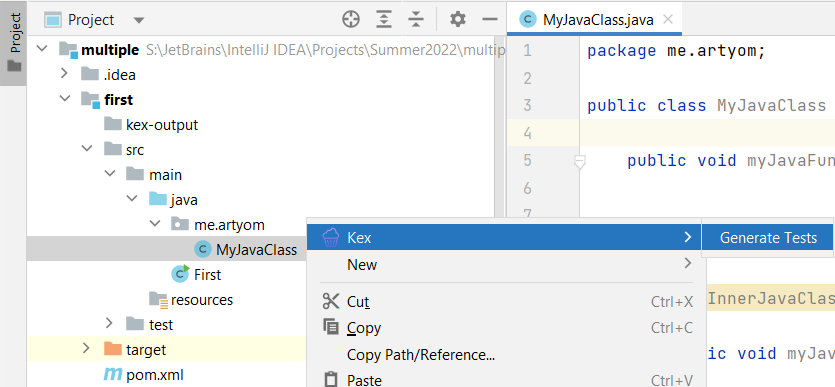
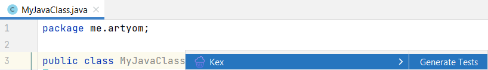
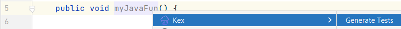
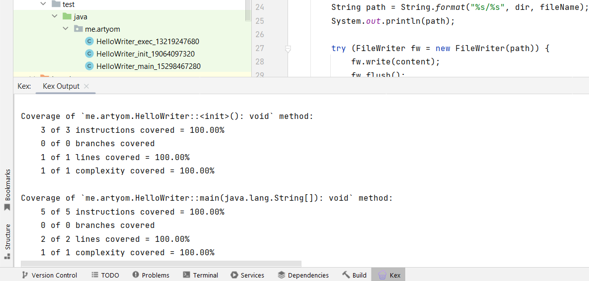
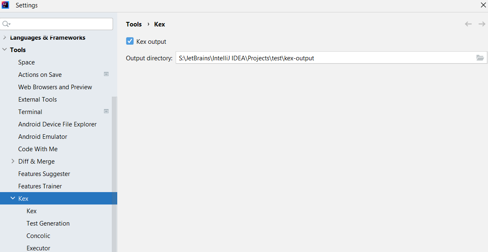

# kex-plugin

[Kex](https://github.com/vorpal-research/kex) is an automatic white-box unit test generation tool
for Java and Kotlin.

## Requirements

Plugin has not yet been published to any plugin repository. If you want to use it, you need to clone this repository and 
follow the steps described in 2 subsections below.

### Docker

For Kex execution plugin uses Docker image, which has not yet been published to Docker Hub.
You need to build it yourself using [Dockerfile](Dockerfile):

```
docker build -t kex-jre-slim --progress=plain
```

### IDE Development Instance

If Configuration `Run Plugin` is not set in IDE by default go to: `Gradle`(right toolbar): `kex-plugin/Tasks/intlellij/runIde`.
Run configuration.

## Usage

### Run

#### Project View

In Project View you can run Kex only for Class:



#### Text Editor

In Text Editor you can run Kex both for Class and Method:





### Debug output and generated tests

After clicking *Generate Tests* in context menu, 
a console view with debug and coverage info output will pop up from tool window.



After successful completion of Kex, generated tests will be stored in default test directory of a module 
(upper left part in the image above).

### Settings

Main setting allows you to save files generated by Kex during its work (instrumented classes, logs, etc.):



Other settings are Kex launching options, which are intended for experienced users and Kex developers. 
It is not recommended to change them, if you are not familiar with Kex and its inner structure.


